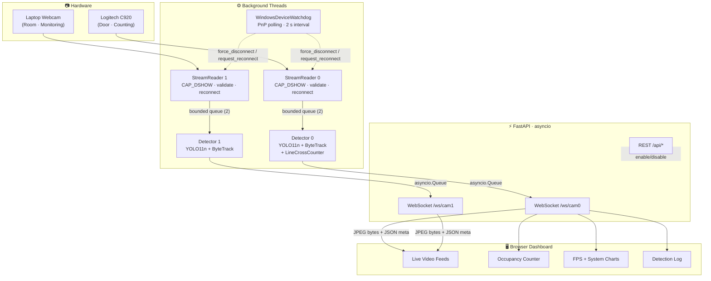

<div align="center">

# 🛡️ Vision Sentinel

**Real-time multi-camera occupancy counting and people detection system**

[](https://python.org)
[](https://fastapi.tiangolo.com)
[](https://ultralytics.com)
[](https://developer.nvidia.com/cuda-toolkit)
[](https://opencv.org)
[](https://www.microsoft.com/windows)
[](LICENSE)

<br/>

> *Monitor who enters and exits — in real time, from any browser.*

<br/>

| 🎯 9–10 FPS per camera | 🔍 Configurable confidence threshold | ⚡ CUDA GPU inference | 🌐 Zero-install web dashboard |
|:---:|:---:|:---:|:---:|

</div>

---

## 📖 Overview

**Vision Sentinel** is a production-grade computer vision pipeline that uses deep learning to monitor building entrances in real time. It tracks every person who crosses a configurable virtual tripwire line, keeping a live count of entries, exits, and current occupancy — all visible from a browser-based dashboard, with no app install required on the client side.

Built as a freelancing portfolio project, it demonstrates end-to-end systems design: from raw camera frames at the hardware level, through GPU inference, up to a live WebSocket dashboard — packaged as a single deployable Python service.

### Business Use Cases

| Industry | Application |
|---|---|
| 🏪 Retail | Store capacity compliance, peak-hour footfall analysis |
| 🍽️ Hospitality | Restaurant and venue occupancy enforcement |
| 🏢 Corporate | Building access monitoring, floor occupancy logging |
| 🎪 Events | Crowd management, zone capacity alerts |
| 🏥 Healthcare | Waiting room overflow detection |

---

## ✨ Features

- **Real-time detection** — YOLO11n detects and tracks people at 9–10 FPS per camera on a mid-range GPU
- **ByteTrack tracking** — persistent person IDs across frames eliminate double-counting at the tripwire
- **Virtual tripwire** — adjustable horizontal line with live entry/exit zone color-shading and direction arrows drawn directly on the feed
- **Occupancy counter** — live IN / OUT / OCCUPANCY display with a configurable capacity alert (visual banner + audio beep)
- **Dual-camera support** — door camera counts crossings; optional room camera monitors who is present inside
- **Live web dashboard** — real-time video feeds, FPS/CPU/RAM/GPU charts, per-detection log, all in one page
- **Runtime camera control** — enable or disable any camera from the dashboard without restarting the server
- **Windows hot-plug detection** — PnP watchdog queries the OS device list every 2 s and forces reconnect on USB camera removal/insertion, bypassing DirectShow's silent rebinding bug
- **Fully configurable** — confidence threshold, inference size, JPEG quality, and capacity limit via `.env`
- **REST API** — tripwire position, counter reset, and camera toggle endpoints for system integration

---

## 🏗️ Architecture



### How the crossing logic works

```
Frame N:   person centroid above the line  →  side = −1
Frame N+1: person centroid below the line  →  side = +1

Sign flipped → crossing detected.
Side at N+1 = +1, entry_direction = "positive"  →  counted as ENTRY.
```

1. Every frame, each tracked person's centroid is compared to the tripwire line using a **2D cross product**
2. A sign change in the cross product between consecutive frames signals a crossing
3. The direction (which side they ended up on) determines **entry** vs **exit**
4. A `crossed_ids` set prevents the same physical crossing from being counted twice
5. When the track ID disappears, it is cleared — the same person can be counted again on re-entry

---

## 🛠️ Tech Stack

| Layer | Technology | Purpose |
|---|---|---|
| Detection | [Ultralytics YOLO11n](https://ultralytics.com) | Person detection, `classes=[0]` only — ~6 MB model |
| Tracking | ByteTrack (built into Ultralytics) | Stable per-person IDs across frames |
| Capture | OpenCV + DirectShow (`CAP_DSHOW`) | Windows multi-camera capture at 640×480 |
| Server | [FastAPI](https://fastapi.tiangolo.com) + Uvicorn | Async HTTP + WebSocket server |
| Streaming | WebSocket (binary JPEG + JSON) | Low-latency browser video delivery (~15 KB/frame) |
| Dashboard | Vanilla HTML + [Chart.js](https://chartjs.org) | Single-file live dashboard, zero dependencies |
| Config | [pydantic-settings](https://docs.pydantic.dev/latest/concepts/pydantic_settings/) | Validated environment-based configuration |
| Monitoring | psutil + GPUtil | Real-time CPU / RAM / GPU metrics |
| Rate limiting | slowapi | REST endpoint protection |
| Logging | loguru | Structured logging with credential masking |
| Watchdog | PowerShell subprocess | Windows PnP USB disconnect/reconnect detection |

---

## 🚀 Getting Started

### Prerequisites

- Windows 10 or Windows 11
- Python 3.10 (conda recommended)
- NVIDIA GPU with CUDA drivers (CPU fallback is available via `DEVICE=cpu`)
- One or two USB or built-in webcams

### 1 — Clone and create environment

```bash
git clone https://github.com/your-username/vision-sentinel.git
cd vision-sentinel

conda create -n ocr310_clean python=3.10
conda activate ocr310_clean
pip install -r requirements.txt
```

### 2 — Configure

```bash
cp .env.example .env
```

Open `.env` and set at minimum:

```env
CAMERA_0_SOURCE=0        # webcam index for your door camera
CAMERA_1_SOURCE=1        # webcam index for your room camera (or set CAMERA_1_ENABLED=false)
DEVICE=cuda              # "cuda" for GPU, "cpu" for CPU-only
CAMERA_0_ENABLED=true
CAMERA_1_ENABLED=true
```

> **Finding your camera indexes** — run this in Python:
> ```python
> import cv2
> for i in range(6):
>     cap = cv2.VideoCapture(i, cv2.CAP_DSHOW)
>     if cap.isOpened():
>         print(f"Camera found at index {i}")
>         cap.release()
> ```

> **Finding your PnP device names** (needed for hot-plug detection) — run in PowerShell:
> ```powershell
> Get-PnpDevice -Status OK | Where-Object { $_.Class -in 'Image','Camera' } | Select-Object FriendlyName
> ```
> Copy the exact names into `CAMERA_0_DEVICE_NAME` and `CAMERA_1_DEVICE_NAME`.

### 3 — Run

```bash
# Must be run from inside the vision_sentinel/ directory
cd vision_sentinel
uvicorn app.main:app --host 0.0.0.0 --port 8000 --ws-ping-interval 0
```

> ⚠️ **Never add `--reload`** — it spawns two processes that both grab the cameras simultaneously.

### 4 — Open the dashboard

Visit **[http://localhost:8000](http://localhost:8000)** in any browser on the same network.

---

## ⚙️ Configuration Reference

All settings live in `.env`. The server reads them on startup. Camera enable/disable can also be toggled live via the dashboard or API without restarting.

| Variable | Default | Description |
|---|---|---|
| `CAMERA_0_SOURCE` | `0` | Webcam index or `rtsp://` URL — door camera |
| `CAMERA_1_SOURCE` | `1` | Webcam index or `rtsp://` URL — room camera |
| `CAMERA_0_NAME` | `Logitech` | Display name on the dashboard |
| `CAMERA_1_NAME` | `Laptop Webcam` | Display name on the dashboard |
| `CAMERA_BACKEND` | `dshow` | `dshow` (Windows) · `v4l2` (Linux) · `""` (auto) |
| `CAMERA_WIDTH` | `640` | Capture width in pixels |
| `CAMERA_HEIGHT` | `480` | Capture height in pixels |
| `CAMERA_0_ENABLED` | `true` | Start camera 0 on boot |
| `CAMERA_1_ENABLED` | `true` | Start camera 1 on boot |
| `MODEL_PATH` | `models/yolo11n.pt` | Path to YOLO weights |
| `CONFIDENCE_THRESHOLD` | `0.75` | Minimum detection confidence (0–1). Raise to reduce false positives |
| `INFERENCE_SIZE` | `640` | YOLO input size. `320` is faster; `640` is more accurate |
| `DEVICE` | `cuda` | `cuda` for GPU · `cpu` for CPU-only |
| `FRAME_SKIP` | `1` | Process every Nth frame. `2` skips every other frame for higher throughput |
| `JPEG_QUALITY` | `75` | Stream JPEG quality (1–100). Lower = smaller frames, less bandwidth |
| `MAX_OCCUPANCY` | `3` | Capacity threshold that triggers the red alert banner and audio beep |
| `ENABLE_DEVICE_WATCHDOG` | `true` | Poll Windows PnP device list for USB disconnect/reconnect |
| `CAMERA_0_DEVICE_NAME` | `HD Pro Webcam C920` | Exact PnP FriendlyName for camera 0 watchdog |
| `CAMERA_1_DEVICE_NAME` | `Integrated Camera` | Exact PnP FriendlyName for camera 1 watchdog |
| `API_KEY` | *(set a secret)* | Sent in `X-API-Key` header for protected endpoints |
| `HOST` | `0.0.0.0` | Bind address |
| `PORT` | `8000` | Server port |
| `ALLOWED_ORIGINS` | `http://localhost:8000` | CORS allowed origins, comma-separated |

---

## 📡 API Reference

| Method | Endpoint | Description |
|---|---|---|
| `GET` | `/` | Serve the live dashboard |
| `GET` | `/api/health` | Health check — `{status, timestamp}` |
| `GET` | `/api/status` | Camera + detector + system status *(rate-limited: 30/min)* |
| `POST` | `/api/tripwire` | Set tripwire `{x1, y1, x2, y2, entry_direction}` normalized 0–1 |
| `POST` | `/api/reset` | Reset entry/exit/occupancy counters to zero |
| `POST` | `/api/cameras/cam0/enable` | Enable camera 0 at runtime |
| `POST` | `/api/cameras/cam0/disable` | Disable camera 0 at runtime |
| `POST` | `/api/cameras/cam1/enable` | Enable camera 1 at runtime |
| `POST` | `/api/cameras/cam1/disable` | Disable camera 1 at runtime |
| `WS` | `/ws/cam0` | Binary JPEG frames + JSON metadata stream for camera 0 |
| `WS` | `/ws/cam1` | Binary JPEG frames + JSON metadata stream for camera 1 |

### WebSocket protocol

```jsonc
// Every frame: binary JPEG bytes sent first, then a JSON metadata message

// Detection metadata
{
  "type": "meta",
  "camera": "Logitech",
  "fps": 9.8,
  "frame_number": 412,
  "detections": [
    { "track_id": 3, "class_name": "person", "confidence": 0.91, "bbox": [120, 80, 300, 460] }
  ],
  "metrics": { "cpu_percent": 82, "ram_percent": 85, "gpu_percent": 23, "gpu_name": "GeForce GTX 1650" },
  "counter": {
    "entries": 5, "exits": 3, "occupancy": 2, "capacity_exceeded": false,
    "max_occupancy": 3,
    "tripwire": { "x1": 0.0, "y1": 0.5, "x2": 1.0, "y2": 0.5, "entry_direction": "positive" }
  }
}

// Camera state changes
{ "type": "disconnected", "camera": "Logitech" }
{ "type": "reconnected",  "camera": "Logitech" }
{ "type": "enabled",      "camera": "cam0" }
{ "type": "disabled",     "camera": "cam0" }
{ "type": "keepalive" }   // sent on 2 s queue timeout — keeps the connection alive
```

---

## 📷 Camera Setup Guide

### Positioning the door camera

```
         ┌──────────────────────────────────┐
         │                                  │
         │   [ OUTSIDE / ENTRANCE AREA ]    │  ← EXIT zone  (red tint on feed)
         │                                  │
         │ ══════════ TRIPWIRE ══════════   │  ← Adjustable green line
         │                                  │
         │   [  INSIDE / ROOM AREA      ]   │  ← ENTRY zone (green tint on feed)
         │                                  │
         │              📷                  │  ← Camera above the door, facing into room
         └──────────────────────────────────┘
```

Mount the camera **above the door frame, facing into the room**. The lens should capture both the entrance area (outside) and the space just inside.

### Entry / exit direction

With the default `entry_direction=positive`:

| Movement | Y change | Counted as |
|---|---|---|
| Person walks **toward** the camera (entering) | Y **increases** | ✅ ENTRY |
| Person walks **away** from the camera (leaving) | Y **decreases** | 🚪 EXIT |

If entries and exits are swapped, toggle the direction by posting to `/api/tripwire` with `"entry_direction": "negative"`.

### Moving the tripwire line

The tripwire slider in the dashboard moves the line up and down. For precise placement, post directly to the API:

```bash
curl -X POST http://localhost:8000/api/tripwire \
  -H "Content-Type: application/json" \
  -d '{"x1": 0.0, "y1": 0.45, "x2": 1.0, "y2": 0.45, "entry_direction": "positive"}'
```

Coordinates are normalized (0.0 = top/left, 1.0 = bottom/right), so they work at any resolution.

---

## 📊 Performance

Measured on the development hardware:

| Hardware | Spec |
|---|---|
| GPU | NVIDIA GeForce GTX 1650 (4 GB VRAM) |
| Model | YOLO11n — 6 MB, 320K parameters |
| Cameras | 640×480 @ 30 fps, DirectShow |

| Metric | Value |
|---|---|
| Detection FPS (per camera) | ~9–10 FPS |
| GPU utilization | ~23% |
| CPU utilization | ~80–90% *(bottleneck)* |
| JPEG frame size over WebSocket | ~15 KB at quality 75 |
| End-to-end latency | ~100 ms |

> **Performance tips:**
> - Set `FRAME_SKIP=2` to roughly double throughput at the cost of tracking smoothness
> - Set `INFERENCE_SIZE=320` for ~30% faster inference with slightly lower accuracy
> - Set `DEVICE=cpu` on machines without an NVIDIA GPU (expect ~2–4 FPS)

---

## ⚠️ Known Limitations

| Limitation | Details |
|---|---|
| **Windows only** | Uses `CAP_DSHOW` and a PowerShell PnP watchdog. Linux/Mac require a different camera backend (`v4l2` or `""`) and no watchdog. |
| **Single counting line** | One virtual tripwire per camera. Multi-zone counting is not yet supported. |
| **Camera angle matters** | Optimal accuracy requires the camera to face into the room from above the door. Overhead or angled views reduce detection accuracy. |
| **Simultaneous crossings** | Two people crossing the tripwire at the exact same frame may be counted as one. |
| **CPU bound** | At ~80–90% CPU utilization, other running applications may cause FPS to drop below 9. |
| **No data persistence** | Counters reset on server restart. No database or CSV export yet. |
| **Docker on Windows** | `CAP_DSHOW` is unavailable inside Linux containers. Docker deployment requires an RTSP IP camera source and a Linux-compatible backend. |

---

## 🗂️ Project Structure

```
vision_sentinel/
├── app/
│   ├── main.py        # FastAPI app, lifespan, WebSocket handler, REST endpoints
│   ├── camera.py      # StreamReader — threaded capture with reconnect and frame validation
│   ├── detector.py    # Detector — YOLO11 + ByteTrack + zone overlay rendering
│   ├── counter.py     # LineCrossCounter — tripwire geometry (2D cross product)
│   ├── monitor.py     # get_system_metrics() — CPU / RAM / GPU via psutil + GPUtil
│   ├── config.py      # Settings — pydantic-settings reads and validates .env
│   └── watchdog.py    # WindowsDeviceWatchdog — PnP USB disconnect detection
├── static/
│   └── dashboard.html # Single-file live dashboard — HTML + Chart.js + WebSocket client
├── models/
│   └── yolo11n.pt     # YOLO11 nano weights (~6 MB)
├── logs/
├── .env               # Your secrets and config — never committed
├── .env.example       # Safe template — commit this
├── requirements.txt
└── README.md
```

---

## 🤝 About This Project

This project was built as a **freelancing portfolio piece** to demonstrate production-level Python systems design with computer vision. It covers:

- **Concurrent pipeline** — threading + asyncio, safely bridged via `asyncio.run_coroutine_threadsafe`
- **Real-time video streaming** — binary WebSocket delivery, bounded queues, stale-frame dropping
- **GPU-accelerated inference** — YOLO11 + ByteTrack with CUDA, two independent model instances
- **Windows hardware integration** — DirectShow, PnP watchdog via PowerShell, USB hot-plug handling
- **Clean REST API** — rate limiting, CORS, API key auth, pydantic-validated config
- **Geometry** — 2D cross product–based line crossing detection, normalized coordinates

---

**Looking to build a custom occupancy monitoring, people counting, or computer vision system?**  
I take on freelancing projects for retail, hospitality, and facility management clients.

---

## 📄 License

Distributed under the MIT License. See [`LICENSE`](LICENSE) for details.

---

<div align="center">

Built with Python · FastAPI · YOLO11 · ByteTrack · OpenCV · Chart.js

</div>
